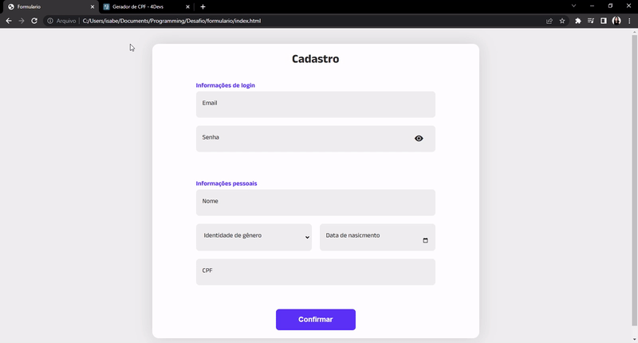

<h1 align="center">Projeto de formulário</h1>
 

  <h2 align="center">:books: O que aprendi:</h2>
  <ul>
    <li>Adicionar efeitos visuais na validação de formulários</li>
    <li>Criar mensagens customizadas para cada campo do formulário</li>
    <li>Regra geral para validar CPF</li>
    <li>Animações com @keyframes e JavaScript</li>
  </ul>

 

  <h2>Live do projeto</h2>
  

